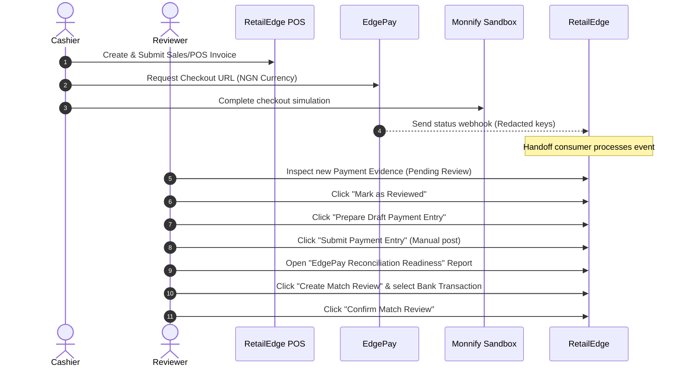

# RetailEdge EdgePay Integration - Limited Rollout Operator Quickstart

This guide is the operational quickstart for selected human operators participating in the limited sandbox rollout of the EdgePay + RetailEdge integration.

---

## 1. What Operators Should Test
* **Payment Request & Checkout**: Start payments from Sales Invoices and POS Invoices, verify checkout initialization, and ensure sandbox payment completes.
* **Webhook & Evidence Intake**: Confirm the handoff queue populates a `RetailEdge EdgePay Handoff Log` and creates a `RetailEdge EdgePay Payment Evidence` in `Pending Review` status.
* **Review & Approval**: Approve evidence manually after verifying invoice details.
* **Manual Posting Guard**: Prepare draft Payment Entry, check preflight conditions, and manually submit the Payment Entry.
* **Reviewer-Assisted Matching**: Execute reconciliation search for candidate bank transactions, create a Bank Match Review, and confirm it manually.

---

## 2. What Operators Must NOT Do
* 🛑 **Do NOT Commit or Log Credentials**: Under no circumstances should real API keys, secret keys, or passwords be stored in code files, logs, screenshots, or comments.
* 🛑 **Do NOT Run Real Live Payments**: Ensure the provider has `Sandbox Mode = 1` active and settings have `Allow External HTTP Calls = 0`.
* 🛑 **Do NOT Auto-Submit or Auto-Confirm**: Every step (review, draft prep, submission, match creation, confirmation) must be triggered manually via operator buttons. No automation is allowed.
* 🛑 **Do NOT Mutate Invoice Paid Status Directly**: Never manually override or edit the paid status of a Sales/POS invoice. Always close invoices through the standard linked `Payment Entry` posting flow.

---

## 3. Step-by-Step Flow

### Flow Walkthrough
1. **Invoice Submission**: Create a Sales Invoice (`NGN` currency) with an integer amount (e.g. `1500.00`) and submit.
2. **Checkout Launch**: Click checkout on POS, load the sandbox URL, and pay.
3. **Webhook Verification**: Confirm webhook arrives at the listener endpoint.
4. **Handoff Log**: Open `RetailEdge EdgePay Handoff Log` and verify state is `Processed`.
5. **Evidence Intake**: Open `RetailEdge EdgePay Payment Evidence` and check status `Pending Review`.
6. **Manual Approval**: Click **Mark as Reviewed**.
7. **Draft Posting**: Click **Prepare Draft Payment Entry** (Docstatus = 0).
8. **Manual Submit**: Open the draft and click **Submit Payment Entry** (Docstatus = 1).
9. **Match Review**: Go to reports, find candidates, and create a `RetailEdge Bank Transaction Match` review.
10. **Reconciliation Confirmation**: Click **Confirm Match Review** to complete bank matching.

---

## 4. Screenshot Placeholders
* *Figure 1: Monnify Sandbox Checkout Page (Ensure amount is visible; no client api keys in URL or page text).*
* *Figure 2: EdgePay Payment Evidence Review Workspace (Confirm status is 'Pending Review' and amount matches exactly).*
* *Figure 3: Payment Entry Submission Guard dialog (Ensure preflight passes; no ignore flags checked).*
* *Figure 4: Bank Match Candidate Selection list (Verify exact deposit amount and provider transaction reference).*

---

## 5. Blocked / Exception Handling

### Exception Status on Evidence
* **Symptoms**: Review status transitions to `Exception` and processing status is `Failed`.
* **Action**: Check `Error Message` on the Evidence record (secrets are automatically redacted). This is usually due to amount or currency mismatch. Re-verify the source invoice amount.

### Preflight Failure during Posting
* **Symptoms**: Posting preflight blocks draft preparation.
* **Action**: Check if the invoice is already fully paid or linked to another Payment Entry. Reset the draft state if needed.

### Duplicates Alert
* **Symptoms**: Webhook returns a success status but is marked `duplicate`.
* **Action**: This is normal idempotent behavior. No action required; the system prevents duplicate evidence creation.

---

## 6. Preflight Checklists

### Checklist before Confirming Payment Entry
* [ ] Verify the source invoice is submitted and has `NGN` currency.
* [ ] Confirm the Payment Request status is updated to `Paid` in EdgePay.
* [ ] Check that no other Payment Entry is already linked to this invoice.
* [ ] Verify the invoice outstanding amount matches the Payment Evidence amount exactly.
* [ ] Ensure the logged user has the `Accounts Manager` or `RetailEdge Manager` role.

### Checklist before Confirming Bank Match Review
* [ ] Verify that the associated Payment Entry has been submitted successfully (Docstatus = 1).
* [ ] Confirm that the Bank Transaction date is after or on the payment date.
* [ ] Verify that the Bank Transaction deposit amount matches the Payment Entry amount exactly.
* [ ] Check that the Bank Transaction has status `Unreconciled` and has not been matched elsewhere.

---

## 7. Escalation Contacts
* **Technical Integration Issues**: `antigravity-dev-team@retailedge.local`
* **Ledger / Accounting Mismatch**: `finance-support@retailedge.local`
* **Sandbox Gateway Downtime**: `sandbox-gateways@monnify.com`
