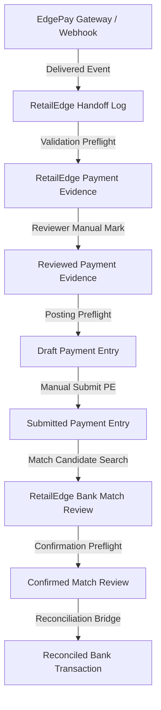

# RetailEdge EdgePay Integration - Operator Guide

This document describes the end-to-end integration lifecycle between EdgePay and RetailEdge, providing operators with detailed status definitions, manual processing steps, safety rules, and troubleshooting instructions.

---

## 1. E2E Lifecycle Overview

The connection between EdgePay (the payment orchestration layer) and RetailEdge (the retail operational layer) operates as a safe, staged pipeline:

---

## 2. Status definitions

### Handoff Log Statuses
- **Pending**: Handoff received from EdgePay but not validated/processed yet.
- **Processed**: Validation succeeded; reviewable RetailEdge Payment Evidence has been safely recorded.
- **Failed**: Validation failed (e.g., source document missing or amount/currency mismatch). Secret values are redacted.

### Evidence Review Statuses
- **Pending Review**: Default state of new Payment Evidence. No accounting mutations are permitted.
- **Reviewed**: Explicitly approved by a reviewer as matching a legitimate successful payment.
- **Rejected**: Explicitly rejected by a reviewer. Cannot be posted.
- **Exception**: System-marked validation mismatch.

### Posting Statuses
- **Not Prepared**: Evidence is pending review or posting preflight.
- **Ready**: Preflight succeeded; eligible for draft preparation.
- **Draft Created**: A draft ERPNext `Payment Entry` has been successfully created.
- **Submitted**: The linked `Payment Entry` has been manually submitted.
- **Blocked / Failed / Cancelled**: Preflight or submission failed.

### Submission Statuses
- **Not Submitted**: Default draft state.
- **Submitted**: Successfully submitted through standard ERPNext validation/rules.
- **Failed / Blocked**: Submission aborted due to ledger/currency validation errors.

### Reconciliation Statuses
- **Not Ready**: Linked payment entry is not submitted or validated.
- **Ready**: Submitted Payment Entry is ready for candidate selection.
- **Matched**: A match review has been created linking the evidence to a Bank Transaction.
- **Reconciled**: The bank transaction matching and reconciliation has been confirmed.
- **Blocked / Exception**: Validation preflight failed (e.g., duplicate references, amount/currency mismatch).

---

## 3. Operator Workflows & Step-by-Step Guide

### Step 1: Reviewing Payment Evidence
1. Navigate to the **EdgePay Review** workspace section.
2. Open **EdgePay Payment Evidence**.
3. Inspect new records with status `Pending Review`.
4. Validate that the payment matches the source customer and invoice context.
5. Click **Mark as Reviewed** to approve the evidence.

### Step 2: Preparing and Posting Draft Payment Entry
1. From the reviewed **EdgePay Payment Evidence** form, click **Prepare Draft Payment Entry**.
2. This invokes a strict posting preflight. If successful, a draft `Payment Entry` is prepared.
3. If preflight fails, the reason is displayed and stored on the document under `Reconciliation Message` (status transitions to `Blocked`).

### Step 3: Submitting the Payment Entry
1. Open the created draft `Payment Entry` linked on the evidence.
2. Click **Submit Payment Entry** on the Payment Evidence form.
3. This triggers standard ERPNext ledger validations and submits the document (changing docstatus to 1).

### Step 4: Creating a Bank Match Review
1. Open the **EdgePay Reconciliation Readiness** report.
2. Click the **Create Match Review** button.
3. Select the target **Payment Evidence**.
4. The system will search for matching bank transaction candidates. Select the correct candidate transaction.
5. Click **Create Match Review** to register the review record.

### Step 5: Confirming the Match Review
1. Go to the **EdgePay Reconciliation Readiness** report or the **EdgePay Payment Evidence** form.
2. Click **Confirm Match Review**.
3. Confirm the dialog prompt.
4. The review transitions to `Confirmed`, and the Payment Evidence status updates to `Matched` (or `Reconciled` once standard bank reconciliation occurs).

---

## 4. Safety Guardrails & Strict Exclusions

To protect audit integrity:
- **No Auto-Submit/Auto-Reconcile**: Schedulers, webhook handlers, and reports do not perform auto-submissions. Every state transition requires explicit reviewer action.
- **No Direct Ledger Mutation**: Operators must not write direct `GL Entry` or `Journal Entry` records for EdgePay-created evidence.
- **No Manual Sales/POS Invoice Paid State Manipulation**: Always use standard `Payment Entry` workflows to close invoices.
- **No Live Gateway API Calls**: Never query Monnify or payment providers directly from operational forms. Use the handoff logs.

---

## 5. Troubleshooting Blocked / Exception Statuses

- **Amount Mismatch**: Ensure the deposited amount on the Bank Transaction matches the Payment Evidence amount within the configured tolerance.
- **Currency Mismatch**: Verify that the transactional currency on the evidence matches the bank account currency.
- **Duplicate Confirmed Match**: A transaction reference or payment entry can only be matched once. Check for other confirmed match review records.
- **Missing Source Document**: If a Sales/POS Invoice is deleted, the handoff will fail. Re-create or restore the document to process.
